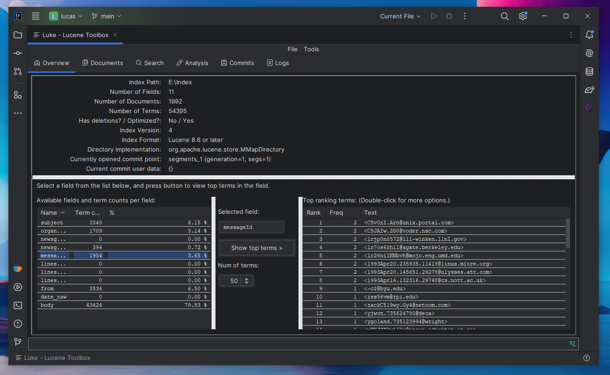

# Lucas (Apache Lucene's Luke for IntelliJ)

<!-- Plugin description -->
Lucas is a plugin that brings [Apache Lucene's Luke](https://github.com/apache/lucene/tree/main/lucene/luke) standalone desktop application to IntelliJ-based IDEs.
Its goal is to provide a way to use Luke in an integrated way.

IMPORTANT: The plugin is in beta state, and will stay in that for a while, so please use it with care, always have a backup of your indexes,
and report issues if you find any.

It aims to also use and mirror the source code and functionality of Luke itself as much as possible, so that
it remains close to the original application, minimizing maintenance efforts, while still providing extra, IDE specific functionality.

The tool can be opened with the menu action at `Tools` / `Luke - Lucene Toolbox`, or via the [Search everywhere](https://www.jetbrains.com/help/idea/searching-everywhere.html)
feature with the same name, and it opens on a new editor tab.
Only one Luke editor tab can be open at once, calling the action again focuses on the already open Luke editor.

## IntelliJ 2024.2+ and JDK 21 support

Starting from Lucas v0.4.0, the plugin is built on JDK 21 as required by the IntelliJ Platform.

Since some parts of Lucene use preview features from Java 21, namely the Foreign Function and Memory API,
and lucene-core includes Java 19, 20 and 21 variants of some classes using that API,
there are a few workarounds in the plugin to make sure those classes are available, and work with Java 21 properly.

For users of Lucas, make sure you add the `--enable-preview` JVM argument to the IDE's custom VM options
under `Help` > `Edit Custom VM Options...`, and then restart your IDE. This may or may not have side effects
to how your IDE operates.

## Differences to Luke

Main differences between Lucas and Luke:
- Opening the Luke tab in the IDE doesn't open up the **Open Index** dialog automatically. A plugin setting might be added in a future release to toggle this.
- Luke's themes are removed. The plugin uses the theme currently set in the IDE.
- Some buttons, icons, and UI element sizes are different, and may be located slightly elsewhere, to provide a smoother integration and user experience.
- The Help menu and About dialog have been removed.

## Known issues

The Create index menu option is removed for now due to some unknown, potentially classloading related, issue that prevents the
index creation to execute.
<!-- Plugin description end -->

### Reporting issues

Changes (maybe with some exceptions) will be introduced only when they have already been introduced in Luke itself (be it feature or bugfix),
or when they are specific to the IDE/plugin and don't require a corresponding change in Luke.

Thus, before reporting an issue, please check if it can be reproduced in Luke itself (depending on the nature of the issue).
If it can be, please raise the issue under the [Apache/Lucene](https://github.com/apache/lucene) repository, otherwise report it in this one.

### Project structure notes

Files that were copied from Lucene/Luke and modified for this integration, are located inside their corresponding
`com.picimako.[original package in Luke]` packages for easier discovery and mapping.

### The integration process of Luke into IntelliJ

If you are interested in what steps I took to integrate Luke into IntelliJ, or you need a kind of guide to integrate it into a different IDE,
you can find the detailed, sort of step-by-step guide in the [Luke integration steps](/LUKE_INTEGRATION_STEPS.md) document.

---
Plugin based on the [IntelliJ Platform Plugin Template][template].

[template]: https://github.com/JetBrains/intellij-platform-plugin-template